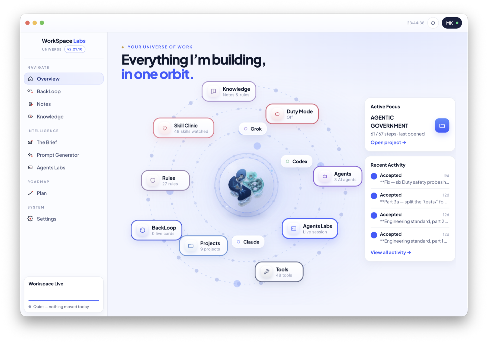

## itsmk91

I build desktop tools that run offline and keep their data on the machine.

---

### [Workspace](https://github.com/itsmk91/workspace)

A macOS app for building software with AI, on a pipeline where **every gate belongs to a person**.

Three agents work the board — one asks the questions and writes the plan, one builds, one reads the code the other wrote and reports the bugs in plain language. They draft plans and deliver finished work. What they never do is decide the work is done: **committing, accepting and rejecting stay with the person.**

Underneath sit twenty-four standing rules, each written together with the failure that produced it — and four guards that simply refuse: destructive commands, work outside an agent's assigned lane, a typeface that breaks the project's design law, a stray key or network call slipping into a build.

Every delivery arrives with a before-and-after picture and a plain-language note, so the work can be reviewed without opening the code.

It reads projects live from disk, never copies them, and runs entirely offline.

`Electron` · `Node` · `macOS`

**[See how it works →](https://github.com/itsmk91/workspace)**

---

### Also building

**BudgetIQ** — shared budgets · **VaultIQ** — inventory · **Luma** — a private companion · **SmartRoute** — document study

Offline-first, all of them. Private repositories.

---

### Elsewhere

[LinkedIn](https://www.linkedin.com/in/mohammad-aljaziri-940750105/)
