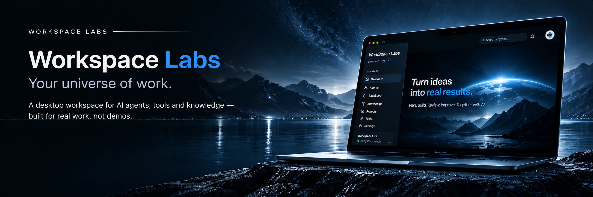

  <a href="https://github.com/workspace-labs/workspace"><strong>AI Agents</strong></a>
  &nbsp;·&nbsp;
  <a href="https://github.com/workspace-labs/workflow-project"><strong>Workflows</strong></a>
  &nbsp;·&nbsp;
  <a href="https://github.com/workspace-labs/human-handoff"><strong>Human Gate</strong></a>
  &nbsp;·&nbsp;
  <a href="https://github.com/workspace-labs?tab=repositories"><strong>Open Source</strong></a>
    
  <a href="https://github.com/workspace-labs/workspace"><strong>View repository →</strong></a>
  &nbsp;·&nbsp;
  <a href="https://workspace-labs.net"><strong>Live site ↗</strong></a>

## Open Source Projects

**[human-handoff](https://github.com/workspace-labs/human-handoff)**
Structured human handoff for AI workflows with audit and clear states.

**[agent-separation-of-duties](https://github.com/workspace-labs/agent-separation-of-duties)**
Split the jobs between agents, and enforce the split.

**[ultracode-discipline](https://github.com/workspace-labs/ultracode-discipline)**
A disciplined workflow for building and verifying code with AI.

**[workspace](https://github.com/workspace-labs/workspace)**
The core workspace platform for AI engineering.

[View all repositories →](https://github.com/workspace-labs?tab=repositories)

## Focus

- AI Engineering
- Open Source Tools
- Agent Workflows
- Human-Centered Design
- Practical Solutions

## Connect

- [Website](https://workspace-labs.net) — workspace-labs.net
- [LinkedIn](https://www.linkedin.com/in/workspacelabs) — in/workspacelabs
- [X](https://x.com/workspacelabs91) — @workspacelabs91
