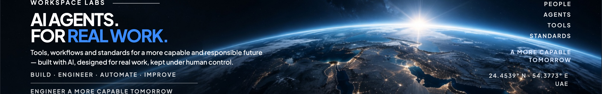
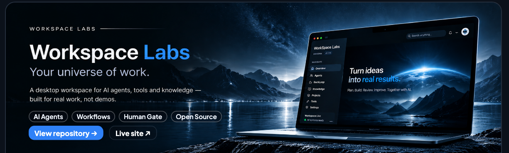

  

  

  <a href="https://github.com/workspace-labs/workspace"><strong>AI Agents</strong></a>
  &nbsp;·&nbsp;
  <a href="https://github.com/workspace-labs/workflow-project"><strong>Workflows</strong></a>
  &nbsp;·&nbsp;
  <a href="https://github.com/workspace-labs/human-handoff"><strong>Human Gate</strong></a>
  &nbsp;·&nbsp;
  <a href="https://github.com/workspace-labs?tab=repositories"><strong>Open Source</strong></a>
    
  <a href="https://github.com/workspace-labs/workspace"><strong>View repository →</strong></a>
  &nbsp;·&nbsp;
  <a href="https://workspace-labs.net"><strong>Live site ↗</strong></a>

## Open Source Projects

<table>
<tr>
<td width="50%" valign="top">
<h3><a href="https://github.com/workspace-labs/human-handoff">human-handoff</a></h3>
Structured human handoff for AI workflows with audit and clear states.
  
<code>AI</code> <code>Governance</code> <code>Safety</code>
</td>
<td width="50%" valign="top">
<h3><a href="https://github.com/workspace-labs/agent-separation-of-duties">agent-separation-of-duties</a></h3>
Split the jobs between agents, and enforce the split.
  
<code>Multi-agent</code> <code>Review</code>
</td>
</tr>
<tr>
<td width="50%" valign="top">
<h3><a href="https://github.com/workspace-labs/ultracode-discipline">ultracode-discipline</a></h3>
A disciplined workflow for building and verifying code with AI.
  
<code>Workflow</code> <code>Quality</code> <code>Best Practices</code>
</td>
<td width="50%" valign="top">
<h3><a href="https://github.com/workspace-labs/workspace">workspace</a></h3>
The core workspace platform for AI engineering.
  
<code>Platform</code> <code>Agents</code> <code>Tools</code>
</td>
</tr>
</table>

<a href="https://github.com/workspace-labs?tab=repositories"><strong>View all repositories →</strong></a>

## Focus

- AI Engineering
- Open Source Tools
- Agent Workflows
- Human-Centered Design
- Practical Solutions

## Connect

- [Website](https://workspace-labs.net) — workspace-labs.net
- [LinkedIn](https://www.linkedin.com/in/workspacelabs) — in/workspacelabs
- [X](https://x.com/workspacelabs91) — @workspacelabs91
